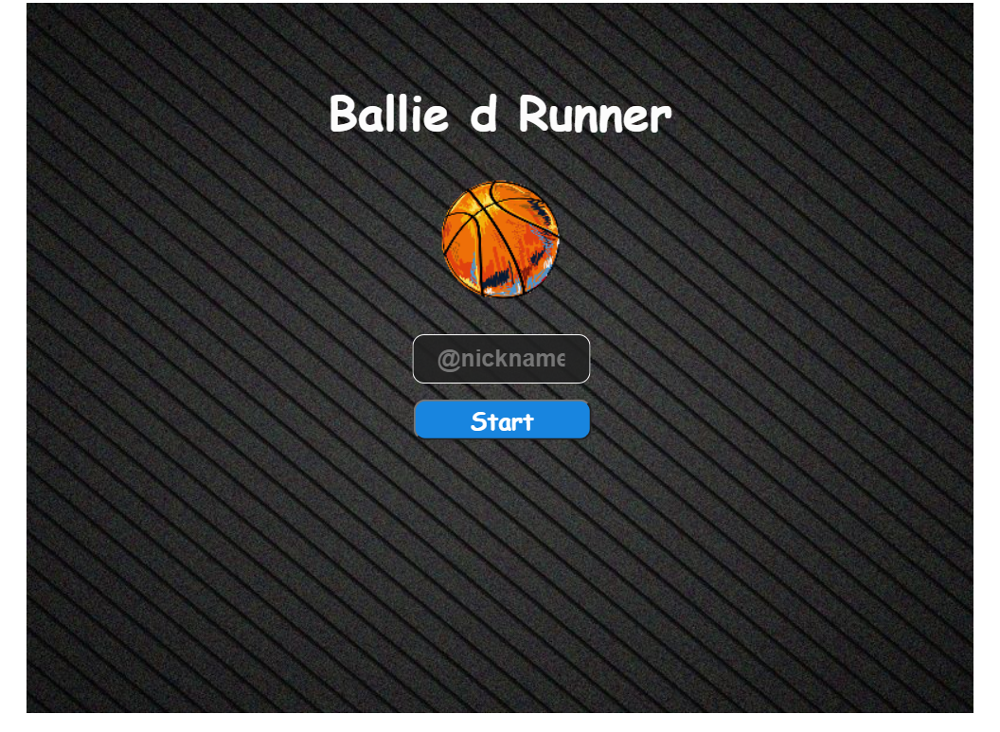
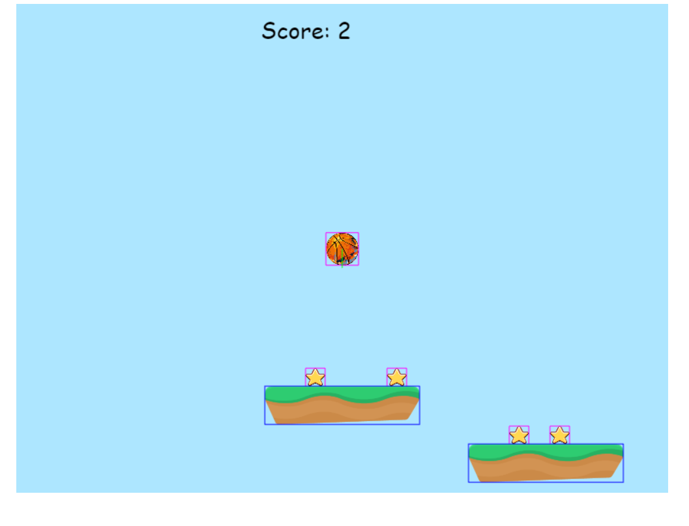
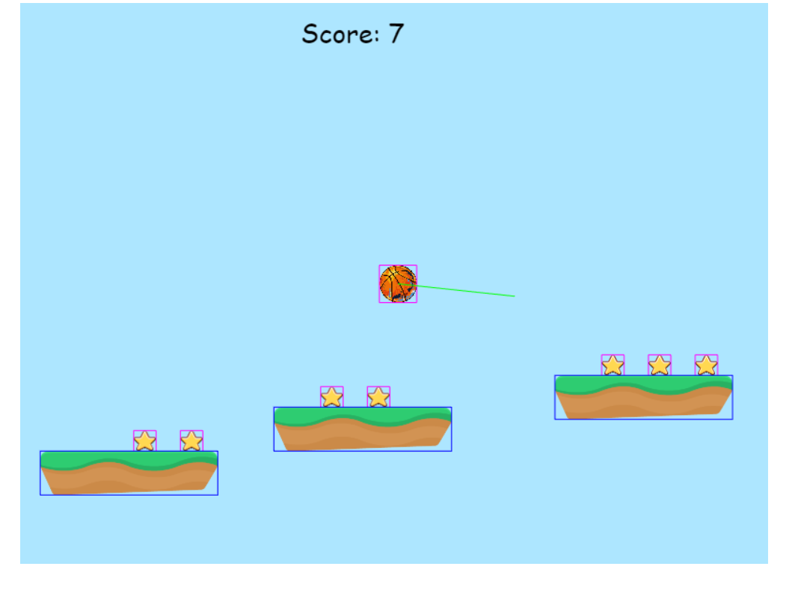
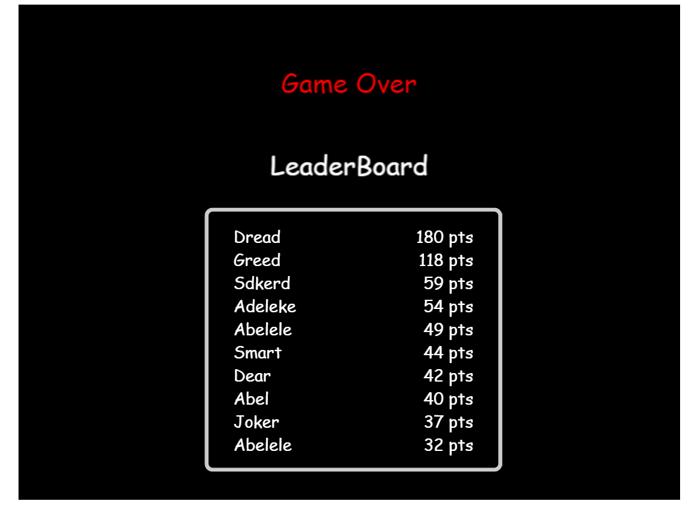

# Ballie d Runner
# A Phaser JS and Webpack project

## Outline
- [Live version](#Live-version)
- [UI Preview](#UI-Preview)
- [Description](#Description)
- [Credits](#Credits)
- [Technologies used](#Technologies)
- [Installation](#Installation)
- [Unit Tests](#Unit-Tests)
- [Author](#author)
- [Licence](#licence)

## Live version
The game is hosted here => [ballDeyRun](https://balldeyrun.netlify.app/).

## UI Preview
|                |                |
|----------------|----------------|
|||
|||


## Description
  This is platform runner game. The player(ball) moves over platforms collecting stars and trying no to fall off.
  The game can be controlled with the following arrows keys;
  ###  
        ====== Movement =====

                Use Key:

                  UP - To move UP
                  DOWN - To stop bouncing
                  LEFT - To move LEFT
                  RIGHT -  To move RIGHT

            ====== New Game ======

            Use Key:
            
              SPACE BAR - To start a new game after failing

            ====== Tip ======

            Try to get as many stars as you can
                  
          
  ## Scoring
  You get 2 to 3 points for collecting a star.

## Credits
  Much appreciation goes to the following for making available the assets used for making this game

  a. Impact Sounds- [Kenney.nl](https://kenney.nl/assets/impact-sounds).
  
  b. [@Ourcade](https://twitter.com/OurcadeHQ?s=20) for tutorials and assets.

  <div class="attribution-block">c. <a href="http://dig.ccmixter.org/files/Karstenholymoly/62493">Stardust (Ziggy is coming)</a> by Kraftamt (c) copyright 2020 Licensed under a Creative Commons <a href="http://creativecommons.org/licenses/by-nc/3.0/">Attribution Noncommercial  (3.0)</a> license. Ft: Platinum Butterfly</div>

## Technologies
- The game was developed with [Phaser](https://phaser.io/).
- HTML5
- Javascript
- CSS
- [Webpack 4](https://webpack.js.org/) for managing javascript assets.
- [Babel](https://babeljs.io/)
- [Github Actions](https://github.com/features/actions) for CI.


## Installation
Follow the steps below run the game in a local environment; First ensure you have [Node.js](https://nodejs.org).

1. Clone the repository from a terminal 
    ```git clone https://github.com/SmithVyne/phaser3-Runner-Game.git```.
2. Navigate to the project directory.
    ```cd phaser3-Runner-Game```
3. Install project dependencies.
    ```npm install```
4. Start the webback server.
    ```npm run start```
webpack will automatically serve the compiled build on http://localhost:8080/.

## Unit-Tests
After cloning this repo, in your terminal
1. Run  ```npm install``` to install project dependencies.
2. Run ```npm run test ``` to run the unit tests locally.


## Author

👤 **Smith Nkereuwem**

- Github: [@SmithVyne](https://github.com/SmithVyne)
- Twitter: [@SmithVyne](https://twitter.com/SmithVyne)
- Email: [email me](smithnkereuwem2@gmail.com)

## Show your support

Give an ⭐️ if you like this project!

## Licence
- MIT
